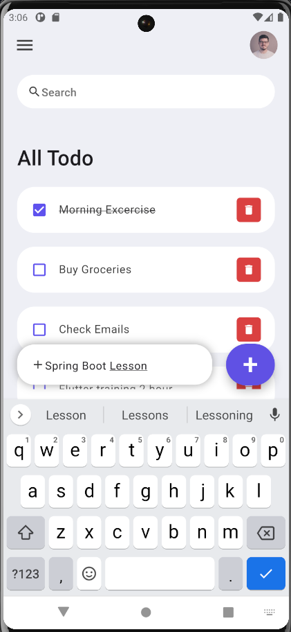
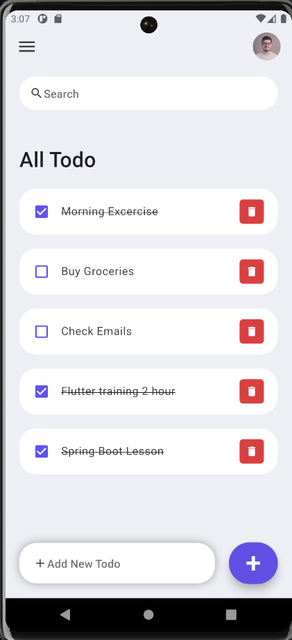
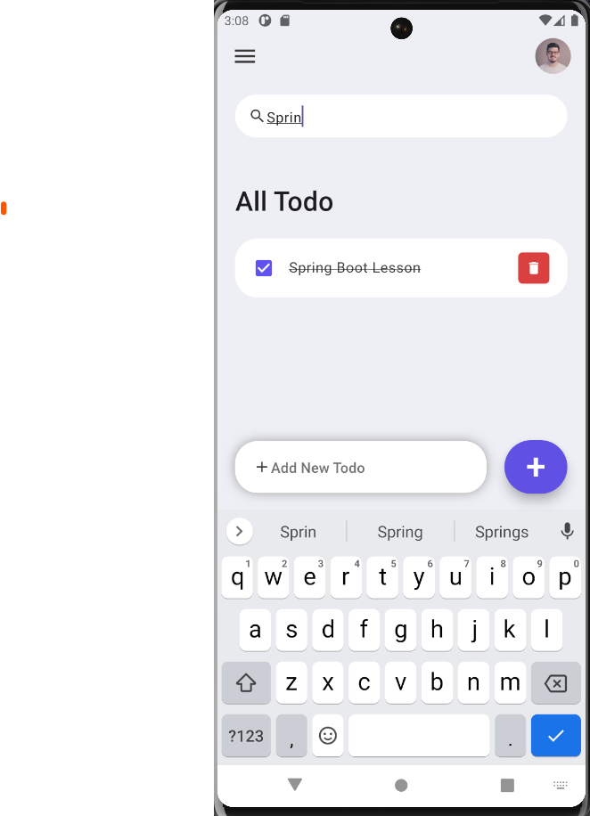

# Todo App

This Todo App is a simple project created to learn the basics of Flutter development. It provides basic functionality such as adding, deleting, searching, and marking todo items as done.

## Features

- **Add Todo:** Add new todo items to your list.
- **Delete Todo:** Remove todo items from your list.
- **Search Todo:** Search for specific todo items.
- **Mark as Done:** Mark todo items as completed.

## Screenshots

## Notes

### ListTile

ListTile is used in lists to represent a single fixed-height row.
It contains leading and trailing icons, text, and other widgets.
**Key properties:**

**leading**: Widget to display before the title.
**title**: Primary content of the ListTile.
**subtitle**: Additional text below the title.
**trailing**: Widget to display after the title.
**selected**: Whether this tile is selected.
**onTap**: Callback function triggered when the tile is tapped.
**enabled**: Whether this tile is interactive.

### IconButton

IconButton is a widget that represents a button with an icon. It's commonly used for actions in an app's AppBar, Drawer, BottomNavigationBar, or within other widgets like ListTile or Card. **Key properties:**

**icon**: The icon to display within the button.
**onPressed**: Callback function triggered when the button is pressed.
**tooltip**: Optional tooltip text that appears when the button is long-pressed.

### Container

Container is a versatile widget used to contain other widgets and provide various visual properties such as padding, margins, borders, and decoration.
**Key properties:**

**child**: The widget that is contained within the container.
**alignment**: Alignment of the child within the container.
**padding**: Empty space to place inside the container.
**margin**: Empty space surrounding the container.
**color**: Background color of the container.
**decoration**: Decoration applied to the container, which can include border, background, and shadow effects.
**width and height:** Explicit dimensions of the container.
**constraints**: Additional constraints to apply to the container's size.

### Scaffold

It's used as the outermost widget for a screen or page and typically contains several other widgets, including an AppBar, a Body, and optionally a BottomNavigationBar, a FloatingActionButton, and more.
**Key properties:**
**appBar**: An optional app bar displayed at the top of the scaffold.
**body**: The primary content of the scaffold, typically a widget like Container, ListView, Column, etc.
**floatingActionButton**: An optional button displayed above the body to perform primary, high-frequency actions.
**bottomNavigationBar**: An optional widget displayed at the bottom of the scaffold, typically used for navigation.
**drawer**: An optional side drawer that slides in from the side of the scaffold.
